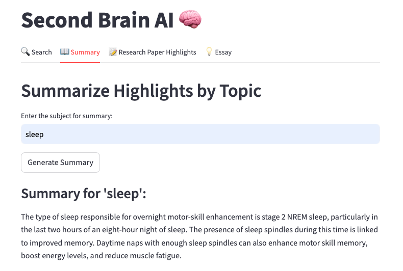
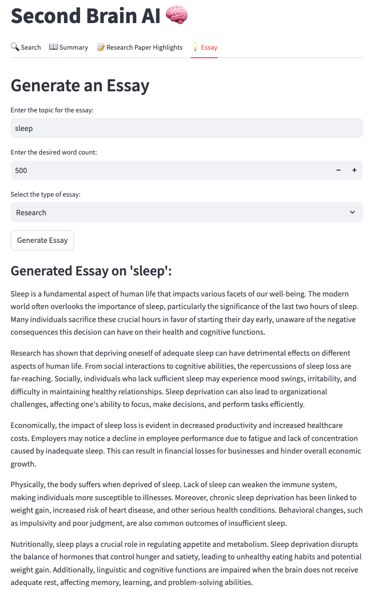

# 🧠 Second Brain AI

This project is designed to help users manage and interact with their knowledge effectively, particularly through highlights from research papers, books, or any other documents. Users can generate research summaries, essays, and detailed insights based on specific topics. The project was demoed during a hackathon and you can find a video of the demo [here](https://youtube.com/your-demo-link).

---

## 📑 Table of Contents
1. [General Info](#general-info)
2. [Screenshots](#screenshots)
3. [Demo](#demo)
4. [Technologies and Tools](#technologies-and-tools)
5. [Setup](#setup)
6. [Process](#process)
8. [Features](#features)
9. [Status](#status)
10. [Contact](#contact)

---

## 📜 General Info
This project builds an interactive tool that allows users to create research summaries, essays, and relevant highlights using AI. Users can retrieve structured information from a collection of highlights by inputting a topic or section. It supports different essay formats, summary generation, and more, utilizing LlamaIndex for efficient querying and embedding techniques.

Key features include:
- Topic-based research highlights
- Detailed summary generation
- Essay creation with user-defined word limits and formats

The project was demoed during the Rag-A-Thon, focusing on leveraging Agentic RAG and workflows. Devepost link [here](https://devpost.com/software/second-brain-ai).

---

## 📸 Screenshots
Here are some visuals from the project.

   
1. **Research Highlights Tab**  
   
   
2. **Essay Generation Tab**  
   

---

## 🎥 Demo
You can view a full project demo [on YouTube](https://youtube.com/your-demo-link).

---

## 🛠 Technologies and Tools
The project leverages the following technologies and tools:

- **Python**: Core language for backend processing
- **Streamlit**: Web framework for building interactive UI
- **LlamaIndex (GPT Index)**: Used for querying and interacting with documents
- **Transformers**: Used for embedding text and similarity matching
- **Google Docs API**: To pull document highlights directly
- **Pandas**: Data processing and management
- **Spacy**: For Named Entity Recognition (NER)
- **Hugging Face Transformers**: For text embeddings and further AI-driven features

---

## ⚙️ Setup

1. Run the project directly on Google Colab by following [this link to the Colab notebook]([https://colab.research.google.com](https://colab.research.google.com/drive/15veD9VI-WAt0y6oqxyYkBBGY0Q_Ad69Q?usp=sharing)) and creating a copy of it.

2. Alternatively, you can download the Jupyter Notebook from this repository and run it locally. 

---

## 📊 Process

### 1. **Data Collection**:
   The highlights are sourced from Google Docs using the Google Docs API, allowing easy import of reading highlights or uploaded manually into the system.

### 2. **Data Preprocessing**:
   The raw text highlights undergo preprocessing using:
   - SpaCy is used for text cleaning and named entity recognition (NER).
   - Custom functions to clean and standardize the text.

### 3. **Querying with LlamaIndex**:
   The LlamaIndex Query Engine is used to search through the document highlights efficiently. 
   It helps retrieve the most relevant information using text-based searches for research papers, summaries, or essays.

### 4. **Generating Summaries and Essays**:
   Based on the user's input, the system generates:
   - Summaries of specific topics within the text.
   - Custom essays using the processed highlights, following the user's preferences in style and length.

---

## ✨ Features

- Pull and preprocess Google Docs highlights.
- Efficient searching and summarizing of text using LlamaIndex.
- Generate research papers and essays based on user inputs.
- User feedback integration for refining results.
- Multiple essay types (research, editorial, etc.) with configurable word limits.
- Customizable output formats (bullet points, plain text, etc.).

---

## 🚧 Status

This project is currently in its initial development phase. Future improvements will include agentic workflows, more efficient knowledge retrieval, and innovations in AI. Features like direct export to Word and integration with other knowledge management tools are also planned for future updates. Stay tuned as I continue to enhance and expand the functionality!

---

## 📧 Contact

Created by [Harsh Gupta](https://www.linkedin.com/in/harshgupta). Please feel free to contact me if you have any questions or collaboration opportunities.

   
